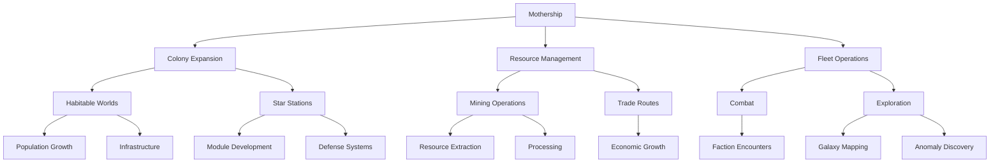
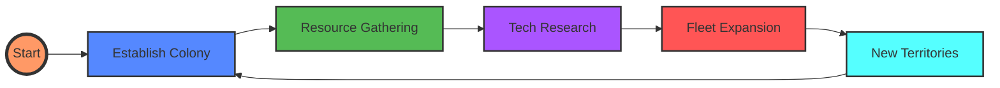
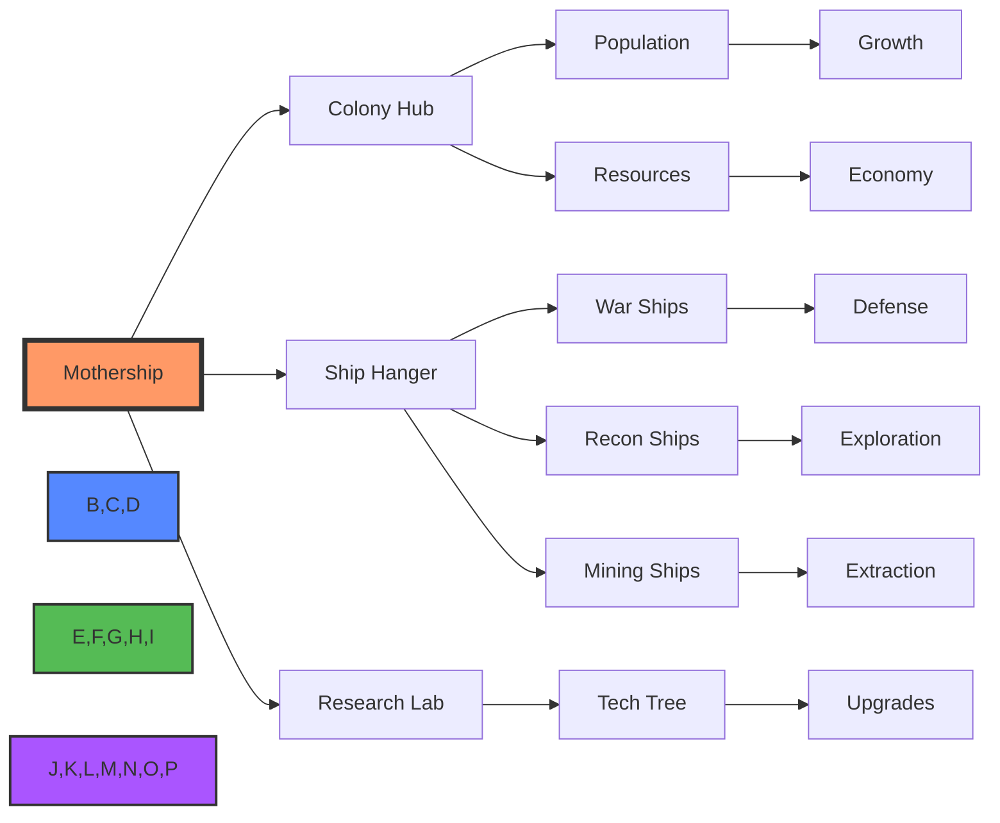
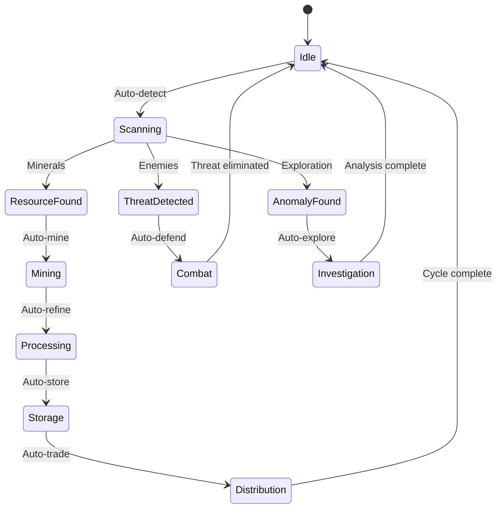
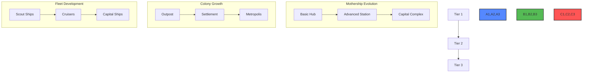

# Galactic Sprawl

## Overview

Galactic Sprawl is an immersive space empire management game where players expand their influence from a central Mothership outward through colonization, resource management, and strategic development. The game emphasizes automated processes, visual progression, and interconnected systems that create a living, evolving galaxy.

## Prompting to Setup files

```
1. Review the @.cursorrules file in full, it is the core of your new comprehensive workflow. It **MUST** be adhered to during the CodeBase Restructuring.
2. Begin setting up `System Documents` with proper context from the CodeBase. The Core files you will be using as the AI Developer are: @CodeBase_Docs/System_Integration.md and @CodeBase_Docs/System_Architecture.md .
3. Review the `System Documents` and being providing the proper context to ensure the files are using the code base specifications. Currently they are general specifications, they need to be updated with the CodeBase Context. **DO NOT** Remove any of these workflows, only implement them with our CodeBase for smooth transition and graceful handling with future implementations.
```

### Prompting A New Conversation

```
1. Review the @.cursorrules file, you must adhere to the strict workflow to ensure CodeBase consistency. Ensure you are updating and reviewing the `Cursor System Documents` and seeking Context in the `Codebase Context Documents`
2. Continue to the next Task on the [`Scratchpad`](`System_Scratchpad`)
```

## Key Features

### Core Systems

- **Modular Empire Building**: Expand from a central Mothership through interconnected colonies and stations
- **Automated Operations**: Self-sustaining systems for mining, exploration, and colony management
- **Tech Tree Progression**: Three-tiered research system unlocking advanced capabilities
- **Dynamic Economy**: Complex resource management with automated trade routes

### Exploration & Development

- **Dynamic Galaxy**: 50+ explorable star systems with unique characteristics
- **Habitable Worlds**: Colonizable planets with evolving populations and infrastructure
- **Resource Management**: Advanced mining operations with automated resource extraction
- **Colony Development**: Expandable colonies with multiple specialization options

### Combat & Factions

- **Three Distinct Factions**:
  - Space Rats: Aggressive pirates focused on raiding
  - Lost Nova: Exiled scientists using forbidden technology
  - Equator Horizon: Ancient civilization enforcing universal balance
- **Fleet Management**: Multiple ship classes with unique capabilities
- **Strategic Combat**: Dynamic engagement systems with AI-driven behavior

### Visual Progression

- **Real-time Feedback**: Visual representation of growth and development
- **Dynamic UI**: Responsive interface with context-sensitive controls
- **High-fidelity Assets**: Detailed visuals for ships, stations, and effects

## Core Gameplay Flow



### Empire Development Cycle



### Module Interaction Flow



### Automation Systems



### Visual Progression Representation (VPR)



## Technical Architecture

### Core Technologies

- TypeScript
- React
- Redux/Context for state management
- WebGL for advanced graphics

### Key Libraries

- Framer Motion / react-spring: Animations
- react-three-fiber: 3D rendering
- D3.js: Data visualization
- RxJS: Event handling

### Performance Optimizations

- Efficient resource management for 50+ star systems
- Optimized rendering with React.memo and useMemo
- Lazy loading for non-critical components

## Getting Started

### Prerequisites

```bash
node >= 14.0.0
npm >= 6.0.0
```

### Installation

```bash
# Clone the repository
git clone https://github.com/yourusername/galactic-sprawl.git

# Install dependencies
cd galactic-sprawl
npm install

# Start development server
npm run dev
```

## Module Documentation

### Core Modules

- **Mothership**: Central hub for empire management
- **Colony Star Station**: Secondary development centers
- **Exploration Hub**: Manages galaxy exploration
- **Mineral Processing**: Handles resource extraction
- **Ship Hanger**: Fleet construction and management
- **Officer Academy**: Personnel development

### Smart Automation Systems

- War ship automated defense
- Recon ship exploration patterns
- Mining ship resource extraction
- Colony growth and development
- Trade route establishment

### Progression Systems

- Tech Tree Research (TTR)
- Experience and leveling
- Visual Progression Representation (VPR)
- Building upgrades and development

## Development

### Project Structure

```plaintext
src/
├── components/          # React components
├── types/              # TypeScript definitions
├── config/             # Configuration files
├── effects/            # Visual effects
├── hooks/              # Custom React hooks
├── lib/               # Core game logic
├── utils/             # Utility functions
└── styles/            # CSS/SCSS files
```

### Key Concepts

- **VPR (Visual Progression Representation)**: System for displaying growth and development
- **TTR (Tech Tree Research)**: Technology advancement system
- **Automation Purpose (AP)**: Defines automated behavior patterns

## Contributing

We welcome contributions! Please see our [Contributing Guidelines](CONTRIBUTING.md) for details.

### Development Process

1. Fork the repository
2. Create a feature branch
3. Implement changes
4. Submit a pull request

### Code Style

- Follow TypeScript best practices
- Use functional components with hooks
- Maintain consistent naming conventions

## License

This project is licensed under the MIT License - see the [LICENSE](LICENSE) file for details.

## Acknowledgments

- React and TypeScript communities
- Contributors and testers
- Inspiration from classic space strategy games

---

For more detailed information about specific systems, please refer to the documentation in the `GalaxySprawlDocs` directory.
